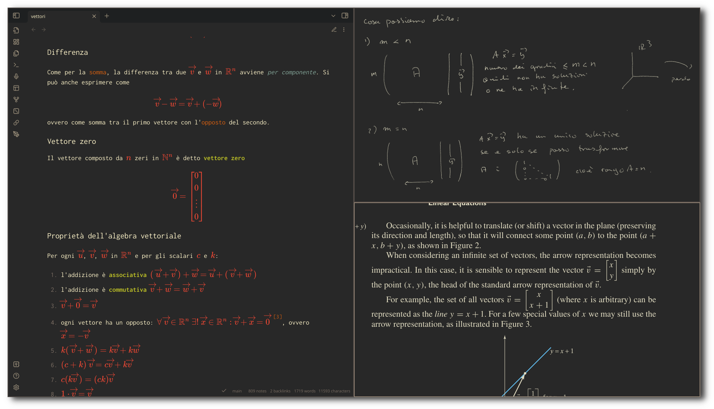

<h1 align="center">ormai/dotfiles</h1>

## Programs

- Linux distribution: [Arch Linux](https://wiki.archlinux.org/title/Arch_Linux)
- Wayland compositor: [Hyprland](https://hyprland.org/)
- bar: [Waybar](https://github.com/Alexays/Waybar)
- terminal: [kitty](https://sw.kovidgoyal.net/kitty/)
    - [Zsh](https://www.zsh.org/) as shell with [syntax-highlighting](https://github.com/zsh-users/zsh-syntax-highlighting) and autocompletion
- menus: [rofi](https://github.com/lbonn/rofi) (lbonn's fork)
    - calculator: [rofi-calc](https://github.com/svenstaro/rofi-calc)
- browser: Firefox, with custom css, [Minimalist Gruvbox](https://github.com/canbeardig/MinimalistFox#minimalist-gruvbox) as theme and, [my startpage](https://github.com/ormai/NewTab)
- text-editor: [neovim](https://neovim.io/) (jump to the [config](https://github.com/ormai/dotfiles/tree/main/dotfiles/nvim))
- notifications: [dunst](https://github.com/dunst-project/dunst)
- file manager: [lf](https://github.com/gokcehan/lf), with [ctpv](https://github.com/NikitaIvanovV/ctpv) for previews
- [Obsidian](https://obsidian.md/) for notes
- btop as system monitor
- mpd + ncmpcpp for music

The wallpaper is managed by [swaybg](https://github.com/swaywm/swaybg) which picks an image *randomly* from a folder.

For the session management [swayidle](https://github.com/swaywm/swayidle) and [swaylock](https://github.com/swaywm/swaylock), which also uses a random image as wallpaper, as configured in [lock.sh](https://github.com/ormai/dotfiles/blob/main/dotfiles/scripts/lock.sh)

### Themes

- GTK theme: [Gruvbox-GTK-Theme by Fausto-Korpsvart](https://github.com/Fausto-Korpsvart/Gruvbox-GTK-Theme) 
- Telegram theme: [tdesktop-gruvbox-dark-medium](https://github.com/ttohin/tdesktop-gruvbox-dark-medium)

## Focus mode

The desktop can turn boring by pressing <kbd>CTRL</kbd>+<kbd>B</kbd>. This is done by a simple [script](https://github.com/ormai/dotfiles/blob/main/dotfiles/scripts/hyprland_focus-mode.sh) that *kills* the bar and toggles some of Hyprland's decorations.

## About

This repository was created on 19/03/2023 and was made public on 29/04/2023.

[r/unixporn post](https://www.reddit.com/r/unixporn/comments/136xdb0/hyprland_my_daily_driver/) (03/05/2023)
